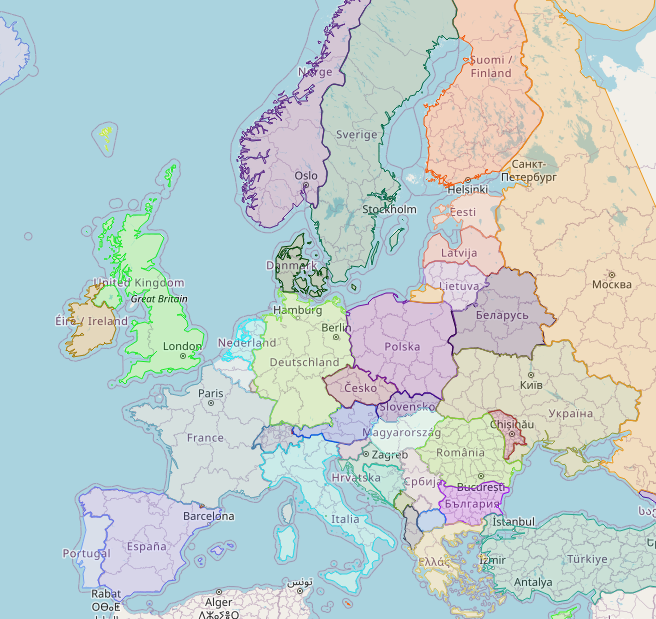

# Application for drawing colored map

Example map


### Requirements:

- MongoDB backend database
- Angular 19+
- Java 21

### Used components

- Map [OpenStreetMap](https://www.openstreetmap.org/)
- Library [leaflet](https://leafletjs.com)
- Bootstrap
- Europe map based on GeoJSON data [map-of-europe](https://github.com/leakyMirror/map-of-europe)

### Start backend

```bash
cd backend
mvn spring-boot:run
```

### Start frontend (viewer)

```bash
cd viewer
npm install
run start
```

### Todo

- role dla dostępu do poszczególnych części systemu
- progresbar dla mapy z krokami na UI
- backend optymalizacja punktów
